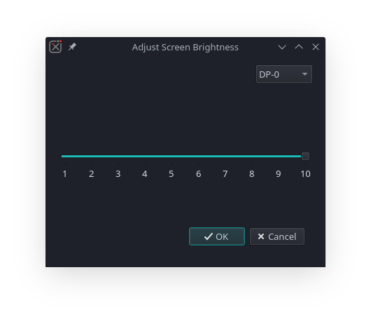

# Screen Brightness

This is a small Python utility that uses xrandr to adjust screen brightness.

# Requirements

The PyPI requirements can be satisfied by cloning the repository and running `pip3 install -r requirements.txt` in the repo directory, or by running `pip3 install "PyQt5~=5.15.4"`

You also need xrandr, which can be installed through your package manager. Yes this does prevent this program from running on Wayland.

 - Arch: `sudo pacman -S xorg-xrandr --needed`
 - Debian: `sudo apt install x11-xserver-utils`
 - Fedora: `sudo dnf install xrandr`

# Installation

This script can easily be installed by putting it in a directory in the PATH. It can also be ran directly with Python by running `main.py` with `python3`, for example, `python3 main.py`

1. Download the `main.py` script or clone the repository.

2. Rename `main.py` to a command name of your choosing. Possibly something like `brightness`.

3. Give the file executable permissions with `chmod +x brightness`.

4. You can place the `main.py` script in `~/.local/bin` or `/usr/bin`. `/usr/bin` is system-wide and requires root, while `~/.local/bin` is for your current user and does not require root.

# Usage

If you followed the installation steps, you should be able to launch the program from the terminal by typing `brightness`. Then you can set the brightness level with the slider. The "OK" button will apply what you current have, and the "Cancel" button will reset the slider to what it was. The monitor can be changed with the dropdown box.

